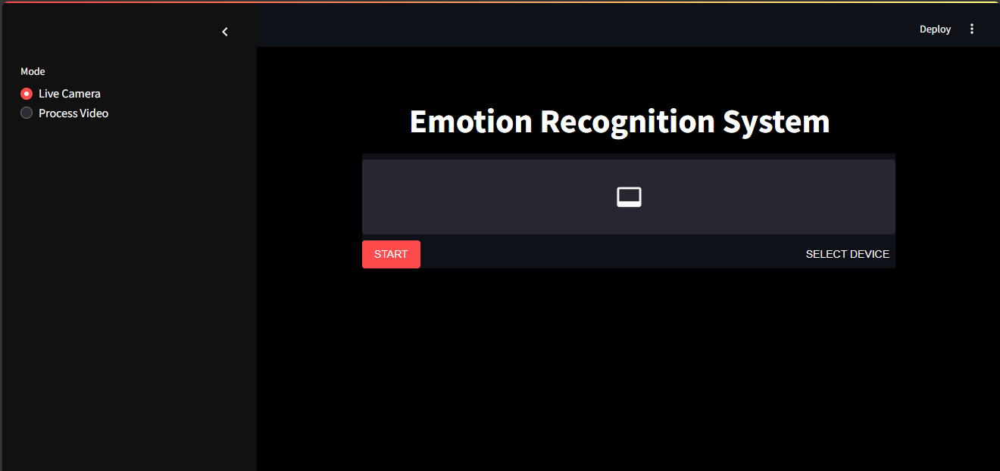
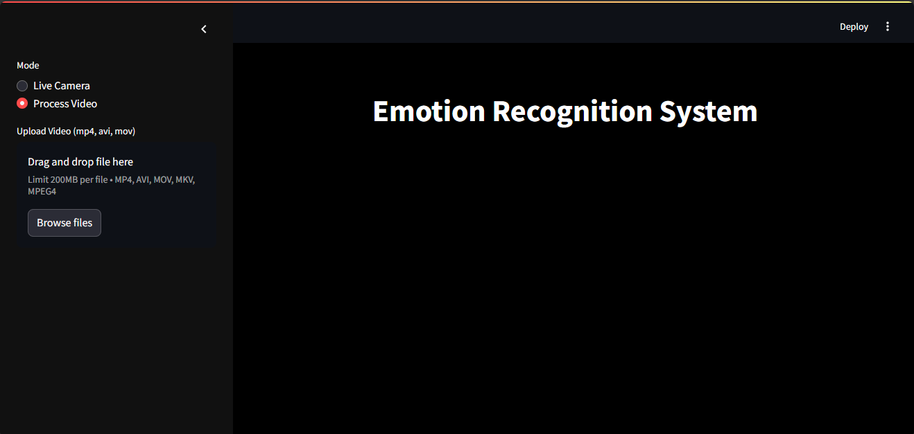
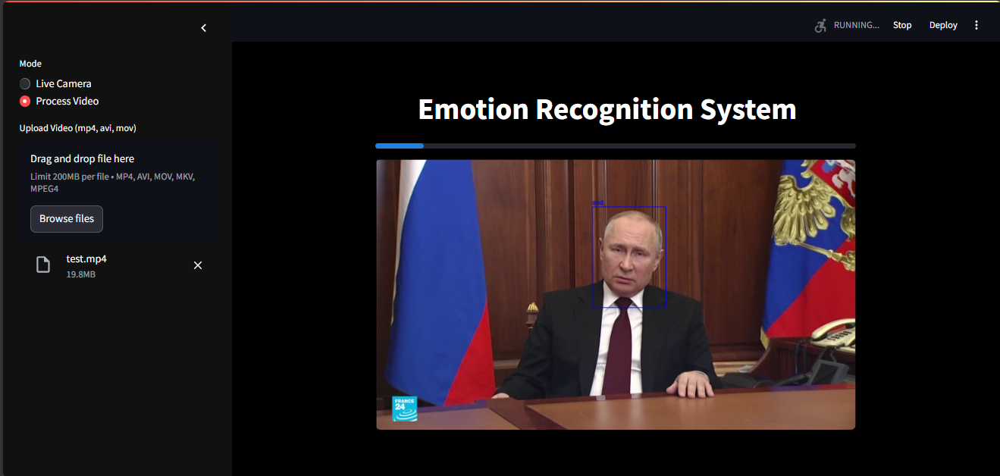

# Emotion Recognition System

A real-time emotion recognition app built with Streamlit and YOLO.

## 🚀 Project Overview

This repository contains a Streamlit-based web application that performs emotion recognition on human faces in two modes:

* **Live Camera**: Capture and analyze live webcam feed.
* **Process Video**: Upload and process video files (MP4, AVI, MOV, MKV).

The system uses two custom YOLOv11 models:

1. **Face detector**: `yolov11s-face.pt` to locate faces in each frame.
2. **Emotion classifier**: `yolov11s-emotion.pt` to predict one of 8 emotions.

Models were fine-tuned on the Roboflow dataset: [Human Face Emotions](https://universe.roboflow.com/emotions-dectection/human-face-emotions/dataset/28).

## 📁 Repository Structure

```
Emotion-Recognition-System/
│
├── models/                       # Folder for pretrained YOLO weights
│   ├── yolov11s-face.pt
│   └── yolov11s-emotion.pt
│
├── images/                       # Screenshots for README
│   ├── screenshot1.png           # Live Camera mode UI
│   ├── screenshot2.png           # Video upload UI
│   └── screenshot3.png           # Processing example
│
├── facial_expression_analysis.py  # Face & emotion detection logic
├── streamlit.py                   # Streamlit app entrypoint
├── requirements.txt               # Python dependencies
└── README.md                      # Project overview (this file)
```

## ⚙️ Installation

Follow these steps to set up the project:

1. **Clone the repository**

   ```bash
   git clone https://github.com/OmarAladi/Emotion-Recognition-System.git
   cd Emotion-Recognition-System
   ```

2. **Create & activate a Conda environment**

   ```bash
   conda create --name emotion-env python=3.10 -y
   conda activate emotion-env
   ```

3. **Install dependencies**

   ```bash
   pip install -r requirements.txt
   ```

4. **Add YOLO model weights**
   Place your fine-tuned weights in the `models/` folder:

   * `yolov11s-face.pt`
   * `yolov11s-emotion.pt`

## 🚀 Usage

Run the Streamlit app:

```bash
streamlit run streamlit.py
```

1. **Live Camera** mode: Select "Live Camera" in the sidebar, grant webcam access, and click "Start".
2. **Process Video** mode: Select "Process Video", upload a video file, and wait for processing to complete. Download or view the annotated output.

### Screenshots

#### Live Camera Mode



#### Video Upload Mode



#### Processing Example



## 📦 Dependencies

Dependencies are managed via `requirements.txt`. Install all required packages within your Conda environment:

```bash
pip install -r requirements.txt
```

Key packages include:

| Package            | Description                        |
| ------------------ | ---------------------------------- |
| `streamlit`        | Web application framework          |
| `streamlit-webrtc` | Live video streaming component     |
| `ultralytics`      | YOLOv11 training & inference       |
| `opencv-python`    | Computer vision operations         |
| ...                | See `requirements.txt` for details |

## 🔧 Customization

* Adjust the face-enlargement scale in `facial_expression_analysis.py` via `scale_factor`.
* Tune detection confidence thresholds in the YOLO calls.

## 🎓 Model Training

Fine-tuned `yolov11s-face.pt` on the Roboflow Human Face Emotions dataset to train the emotion classifier model.

## 🤝 Contributing

Contributions are welcome! Please open issues or pull requests for bug fixes, enhancements, or new features.

## 📜 License

This project is licensed under the MIT License. See [LICENSE](LICENSE) for details.

## 🙏 Acknowledgments

* [Ultralytics](https://github.com/ultralytics) for YOLOv11 implementation
* [Streamlit](https://streamlit.io/) for the web framework
* [streamlit-webrtc](https://github.com/whitphx/streamlit-webrtc) for live video streaming
* Roboflow for the emotion dataset
